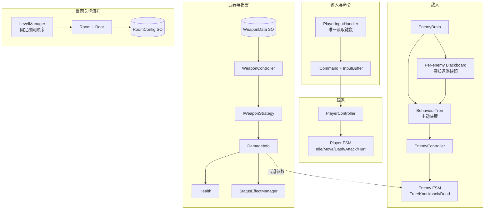
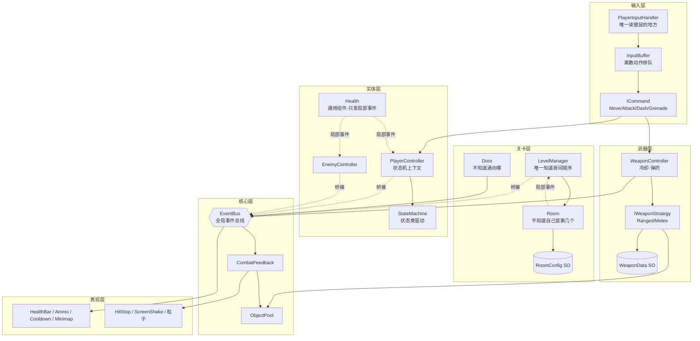

# 2D Roguelike Shooter（《元气骑士》风格）

基于 Unity 的俯视角 2D Roguelike 射击游戏，聚焦**游戏编程模式**与**可迁移架构**，构建一套 V1（2D）→ V2（3D）→ V3（联机）的渐进式工程。

---

## 🎮 项目简介

- **类型**：俯视角 Roguelike 射击
- **引擎**：Unity 6.3 LTS (6000.3.19f1)，2D + URP 模板
- **目标**：以 V1 六周主线跑通完整 2D 游戏循环，再通过 V1.5 深化武器、敌人 AI、关卡与存档系统，并沉淀一套可迁移到后续 3D 和联机版本的低耦合架构。
- **参考游戏**：《Soul Knight》（元气骑士）
- **当前状态**：V1（2D 版）六周主线已经收官；V1.5 的武器/伤害深化、敌人 AI 深化、工程整理与统一调试系统均已完成。V1.5-3 的完整教程和 `Reference/` 未来实现已经准备好，步骤 1 的单局胜负/Seed/重开闭环已完成，下一步实现纯数据地图生成。`v1-week1`~`v1-week6` 标签已打；V1.5 尚未创建标签。最新进度与既定约定见 [AGENTS.md](AGENTS.md)。

---

## 🧱 技术架构（核心模式）

| 模块               | 实现方式                         | 设计意图                                      |
| ------------------ | -------------------------------- | --------------------------------------------- |
| Game Loop          | Update / FixedUpdate 明确分离    | 逻辑与渲染隔离，便于帧率无关逻辑复用          |
| 状态机 + 行为树    | 玩家使用 FSM；敌人使用行为树主动决策 + FSM 被动打断 | 区分主动决策与受击/死亡等强制状态 |
| 事件总线 (EventBus) | 轻量级观察者模式，解耦 UI、血量、拾取等 | 模块间零硬引用，利于单元测试和模块替换    |
| 命令模式           | 将玩家输入封装为命令，支持缓冲队列 | 实现输入缓冲、技能队列，可轻松录制回放 |
| 对象池             | 子弹、手雷和高频特效池化；低频生成的敌人不池化 | 按生成频率控制复杂度并减少 GC |
| 武器策略           | IWeaponStrategy 接口 + ScriptableObject 数据 | 武器即数据 + 策略，新增武器无需改主体逻辑 |
| 伤害与状态异常     | DamageInfo + StatusEffectManager | 统一传递伤害、灼烧、冰冻、易伤与击退信息 |
| 房间流程           | RoomConfig + Room + LevelManager | 当前为数据驱动固定顺序，V1.5-3 再升级为图结构生成 |
| 资源管理           | V1/V1.5 保持现有直接引用，V2 再评估 Addressables | 不提前为低频资源引入额外复杂度 |

### 架构总览（V1.5 当前）



V1.5 的关键变化是两条：伤害链路统一通过 `DamageInfo` 传递，敌人则采用“行为树主动决策 + FSM 被动打断”的双层结构。程序化关卡生成尚未接入，上图中的 `LevelManager` 仍代表当前固定房间顺序实现。

### 架构总览（V1 完成时）



**看这张图的两个要点**：① `EventBus` 是枢纽，但**没有一条箭头是双向的**——UI 只订阅、游戏逻辑只发布，这就是"模块间零硬引用"。② 所有 `-.局部事件.->` 后面都跟着 `-.桥接.->`——**通用组件只发局部事件，"身份"由知道身份的上层补上再广播**（这个套路在 `Health→PlayerController`、`Health→EnemyController`、`Room→LevelManager` 重复了三次）。

---

## 🗺️ 六周开发路线

### 第 1 周：项目搭建与基础移动射击
- Unity 2D 项目初始化，Input System 接入
- 玩家八方向移动 + 面向鼠标旋转
- 单发子弹射击（对象池雏形）
- 敌人追击 + 碰撞伤害
- 最小 Game Loop 框架

### 第 2 周：状态机与敌人基础 AI
- 玩家状态机（Idle, Move, Dash, Attack, Hurt）
- 敌人状态机（Patrol, Chase, Attack, Dead）
- 闪避（Dash）+ 无敌帧 + 受击闪白
- 近战武器原型

### 第 3 周：事件系统与数据驱动武器
- EventBus 接入，UI 血条/子弹数事件更新
- 武器 ScriptableObject（伤害、冷却、子弹类型）
- 策略模式武器切换（手枪/步枪/近战）
- 弹药限制 + 补给拾取

### 第 4 周：命令模式与输入缓冲
- 指令封装（MoveCommand, AttackCommand, DashCommand）
- 输入缓冲队列实现连招
- 技能冷却可视化
- 范围技能（手雷）演示非指向性命令

### 第 5 周：房间生成与关卡流程
- RoomConfig 数据驱动房间敌人/道具布局
- 简单工厂生成敌人和道具
- 房间切换逻辑 + Cinemachine 摄像机平滑过渡
- 3-5 房间关卡，含 Boss 房间
- 小地图 UI

### 第 6 周：打磨、优化与展示
- Shader 特效（受伤溶解、拾取金光）
- 手感优化（相机跟随、命中停顿、屏幕震动）
- 性能 Profiling，对象池泄漏检查
- 架构图、视频录制、技术文档整理

---

## 🛠️ 版本控制与协作

本仓库采用 **Git + Git LFS + Unity Smart Merge** 方案，确保多端同步与团队协作安全。

### 快速开始（个人多设备）
```bash
# 安装 Git 和 Git LFS（首次）
git lfs install

# 克隆仓库
git clone <仓库地址>
cd <项目目录>

# 用 Unity Hub 打开项目，等待 Library 重建
```

### 分支策略（协作推荐）
- `main`：稳定版本，只接受 Pull Request
- `dev`：开发主线
- `feature/<功能名>`：功能分支，开发完毕后合并回 dev

### 冲突处理
仓库根目录的 `.gitattributes` 已将 `.unity`/`.prefab`/`.asset`/`.mat` 等 YAML 资源标记为使用 `merge=unityyamlmerge` 合并驱动。
该驱动的可执行文件路径因本机 Unity 安装位置而异，**每台机器克隆仓库后需各自注册一次**（此配置是本地的，不会被提交）：

```bash
# Windows 示例（按实际 Unity 安装路径调整）
git config merge.unityyamlmerge.driver "\"C:/Program Files/Unity/Hub/Editor/6000.3.19f1/Editor/Data/Tools/UnityYAMLMerge.exe\" merge -p %O %B %A %A"

# macOS 示例
git config merge.unityyamlmerge.driver "'/Applications/Unity/Hub/Editor/6000.3.19f1/Unity.app/Contents/Tools/UnityYAMLMerge' merge -p %O %B %A %A"
```

注册后，冲突时 Git 会自动调用 UnityYAMLMerge；若自动合并失败，请在 Unity 编辑器中手动解决，然后提交。
未注册该驱动也不影响正常工作，只是场景/预制体冲突会退回 Git 默认的文本合并（更容易冲突失败)。

---

## 📂 项目结构说明

### V1.5 当前结构（90 个脚本）

```
Assets/
├── Scripts/
│   ├── AI/                         # 敌人行为树（命名空间 Game.AI）
│   │   ├── Framework/              # Node、组合/装饰节点、Blackboard、BehaviourTree
│   │   ├── Boss/                   # BossPhaseCondition、BossSkillAction
│   │   └── Enemy/                  # 感知条件与巡逻/追击/攻击等通用节点
│   ├── Commands/                   # ICommand、输入缓冲与玩家命令
│   ├── Core/                       # EventBus、事件、对象池与战斗反馈
│   ├── Debug/                      # 分类日志、统一设置、初始化与屏幕调试面板
│   ├── Entities/                   # 玩家/敌人上下文、Health、状态异常、EnemyBrain
│   ├── Level/                      # RoomConfig、Room、Door、LevelManager、工厂
│   ├── StateMachines/              # IState、StateMachine
│   │   ├── Player/                 # Idle、Move、Dash、Attack、Hurt
│   │   └── Enemy/                  # Free、Knockback、Dead（被动打断）
│   ├── UI/                         # 血量、弹药、冷却、小地图、统一结算 UI
│   └── Weapons/                    # WeaponData、WeaponController、AmmoPickup
│       ├── Projectiles/            # Bullet、EnemyProjectile
│       ├── Skills/                 # Grenade、GrenadeThrower
│       └── Strategies/             # IWeaponStrategy、远/近战策略与 Decorator
├── Prefabs/                        # 玩家武器、敌人、房间、粒子等预制体
├── Scenes/                         # 场景文件
├── Data/                           # 武器、敌人行为、房间等 ScriptableObject
├── Art/                            # 精灵、动画、材质
├── Audio/                          # 音效与音乐
└── ThirdParty/                     # 第三方插件或工具
```

V1.5 新增了独立的 `AI` 与 `Debug` 模块，并把原本平铺在 `Weapons`、`AI` 根目录的代码按职责拆入子目录。目录移动保留 `.meta` GUID 与原命名空间，因此不会改变 Unity 序列化类型引用。

### V1 完成时结构（51 个脚本）

```text
Assets/
├── Scripts/
│   ├── Commands/                   # 命令与输入缓冲
│   ├── Core/                       # EventBus、对象池、战斗反馈、CameraFollow
│   ├── Entities/                   # 玩家、敌人和 Health
│   ├── Level/                      # 固定顺序房间流程
│   ├── StateMachines/
│   │   ├── Player/                 # 玩家五态
│   │   └── Enemy/                  # Patrol、Chase、Attack、Dead
│   ├── UI/                         # UI 与 DebugText
│   └── Weapons/                    # 武器、策略、子弹和手雷全部平铺
├── Prefabs/
├── Scenes/
├── Data/
├── Art/
├── Audio/
└── ThirdParty/
```

V1 完成时尚未引入行为树、Blackboard、`DamageInfo` 与状态异常系统；`CameraFollow`、`PlayerShooter` 和教学用脚本也还没有在后续工程整理中删除。因此这棵目录树只用于说明 V1 收官时的历史形态，不代表当前磁盘结构。

---

## 🚀 运行要求

- Unity 6000.3.19f1（建议使用相同版本打开，避免 ProjectSettings/Library 差异）
- Input System package（已包含在项目依赖中，见 `Packages/manifest.json`）
- Cinemachine 3.1.7（第 5 周房间摄像机过渡，已包含在项目依赖中）
- 已配置 Git LFS 的客户端（若拉取时发现资源丢失，请执行 `git lfs pull`）

---

## 📚 参考资料

- 《游戏编程模式》（Game Programming Patterns） - Robert Nystrom
- [Unity 官方 Input System 文档](https://docs.unity3d.com/Packages/com.unity.inputsystem@1.0/manual/index.html)
- [Catlike Coding 渲染教程](https://catlikecoding.com/unity/tutorials/rendering/)
- [UnityYAMLMerge 官方指南](https://docs.unity3d.com/Manual/SmartMerge.html)
- 免费美术素材：[Kenney.nl](https://kenney.nl/) (Rogue-like / RPG Packs)

---

## 🔧 V1.5 深化阶段

V1.5 继续保留 2D 表现，重点从“跑通玩法”转向“深化系统与工程边界”。四个编号只用于玩法深化方向；代码整理、统一调试等工程化插曲使用名称记录，不占用 `V1.5-1`～`V1.5-4` 的编号。

### V1.5 开发路线

| 阶段 | 内容 | 状态 |
|---|---|---|
| V1.5-1 | 武器/伤害深化：Decorator、DamageInfo、状态异常与击退状态 | ✅ 已完成并通过 Play 验收 |
| V1.5-2 | 敌人 AI 深化：行为树、Blackboard 感知迟滞、多敌人类型与 Boss 阶段 | ✅ 已完成并通过 Play 验收 |
| 工程整理 | 目录重组、输入边界收口、warning 清理、状态合并修正与注释补全 | ✅ 已完成并通过 Play 回归 |
| 统一调试 | 分类日志、统一开关、日志转发与屏幕调试显示 | ✅ 已完成并通过静态与 Play 验收 |
| V1.5-3 | 程序化关卡生成：实体连通地图、图结构、特殊房、局内强化与完整单局 | 🚧 步骤 1/8 已完成，下一步生成纯数据地图 |
| V1.5-4 | 存档系统：Memento、版本兼容与持久化边界 | ⏳ 待开始 |

### V1.5 开发日志与标签

V1.5 的完成记录已经独立于 V1 六周日志。下列标签名称是建议命名，**当前尚未创建任何 V1.5 Git 标签**：

- ✅ 建议标签 `v1.5-1`：武器/伤害深化——状态异常、统一伤害包与击退状态（详见 [devlog/V1.5-1.md](devlog/V1.5-1.md)）。
- ✅ 建议标签 `v1.5-2`：敌人 AI 深化——行为树、感知 Blackboard、多敌人类型与 Boss 阶段（详见 [devlog/V1.5-2.md](devlog/V1.5-2.md)）。
- ✅ 建议标签 `v1.5-cleanup`：工程整理——85 个脚本的新目录结构、输入收口、0 warning、注释 review 与 Play 回归（详见 [devlog/V1.5-cleanup.md](devlog/V1.5-cleanup.md)）。
- ✅ 建议标签 `v1.5-debug`：统一调试系统——分类过滤、统一设置、Console/Overlay 转发与输入缓冲显示（详见 [devlog/V1.5-debug.md](devlog/V1.5-debug.md)）。
- 🚧 `v1.5-3`：程序化关卡生成——实体房间与通道、Seed 图结构、特殊房、局内强化与完整单局；步骤 1 的 Run 闭环已完成，尚未达到打标签条件（详见 [devlog/V1.5-3.md](devlog/V1.5-3.md)）。
- ⏳ `v1.5-4`：存档系统。

---

## ✍️ V1 开发日志与标签

V1 以六周为主线，每周对应一个已经创建的 Git 标签 `v1-week<周数>`：

- ✅ `v1-week1`: 基础移动射击、敌人追击、对象池（已完成，详见 [devlog/week1.md](devlog/week1.md)）
- ✅ `v1-week2`: 状态机、闪避、近战武器（已完成，详见 [devlog/week2.md](devlog/week2.md)）
- ✅ `v1-week3`: EventBus、ScriptableObject 武器、策略切换、弹药与拾取（已完成，详见 [devlog/week3.md](devlog/week3.md)）
- ✅ `v1-week4`: 命令模式、输入缓冲、手雷技能、技能冷却 UI（已完成，详见 [devlog/week4.md](devlog/week4.md)）
- ✅ `v1-week5`: 房间系统、关卡流程、Cinemachine 过渡、Boss 房、小地图（已完成，详见 [devlog/week5.md](devlog/week5.md)）
- ✅ `v1-week6`: 命中停顿、屏幕震动、粒子特效、GC 优化、对象池泄漏诊断、构建打包、通关收尾（已完成，详见 [devlog/week6.md](devlog/week6.md)）

---

## 📄 许可

本项目仅用于个人学习与作品集展示，代码和资源遵循对应原始来源的许可。
Kenney 素材可自由使用（具体参见其官网许可条款）。
