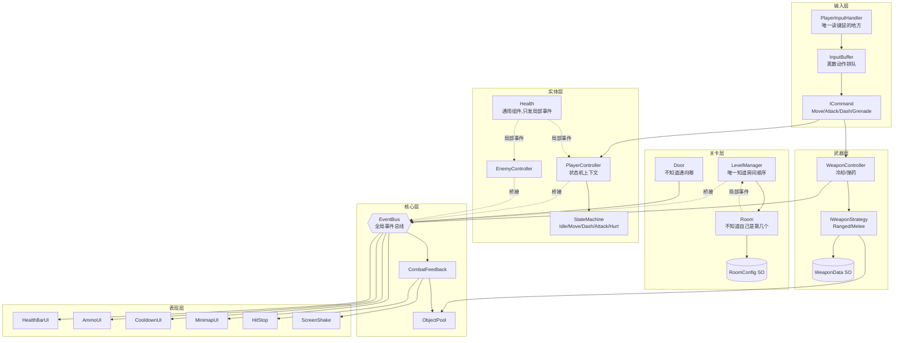

# 第 6 周:打磨、优化与展示(最后一周)

> 前五周你搭出了一副**能跑的骨架**:状态机(行为)、EventBus(通信)、策略 + SO(数据驱动)、命令 + 缓冲(输入)、对象池(性能)、房间与关卡流程。
>
> 但它现在还**不像一个游戏**——打中敌人没有任何"手感",子弹命中就是数字悄悄少了一截。这周补的就是这最后一层:**Juice(汁水感)**。你会发现这层东西**代码量极小、效果极大**——命中停顿只有十几行,但打击感的差别是天壤之别。
>
> 这周还有一件事:**回头看看自己写的代码在性能上是什么样子**。Profiler 会告诉你哪些地方在偷偷制造垃圾——而其中几处,正是你前几周亲手写下的。
>
> 照旧分 4 步,每步可编译、可 Play 验收。参考实现在 `Reference/Scripts/...`。

## 本周目标(对齐 README 六周计划)

- **手感优化**:命中停顿(Hit Stop)+ 屏幕震动(Screen Shake)。
- **特效**:粒子(命中火花、死亡爆炸、拾取金光)+ Shader Graph 入门(选做)。
- **性能 Profiling**:找 GC 热点、对象池泄漏检查。
- **架构图 + 技术文档整理**、构建打包。

完成后:每一枪打在敌人身上都有**顿挫感 + 屏幕轻微一震 + 火花四溅**;敌人死亡是一次更明显的爆炸和震动;Profiler 里战斗时的 GC Alloc 接近 0;有一张架构图和一个能双击运行的 exe。

---

## 步骤 1:手感三件套(命中停顿 + 屏幕震动)

**这一步做什么**:让"打中"这件事有物理反馈。这是这周性价比最高的一步——**十几行代码,手感提升的幅度超过前面任何一周的任何一个功能**。

### 1.1 先理解:什么是 Juice?

同样一发子弹打中敌人,可以是:

- **无 Juice**:敌人血条数字变了一下。
- **有 Juice**:画面停顿 0.04 秒 → 屏幕震一下 → 火花溅开 → 敌人闪白。

**逻辑上它们完全一样**(伤害数值都是 12)。但玩家的体感差了十倍。这就是为什么《元气骑士》《以撒》这类游戏,即便美术很简单,打起来依然爽。

这周要做的**不是新功能,而是给已有功能加反馈**。

### 1.2 设计:语义事件 vs 表现指令

问题来了:**谁来触发这些反馈?**

最直接的想法是在 `Bullet.OnTriggerEnter2D` 里写 `HitStop.Do(0.05f); ScreenShake(...)`。**别这么做**——那等于让子弹知道"打中要震多少屏"。屏幕震动是**表现层的决策**,不是子弹的职责。改一次手感,你得去改子弹、近战策略、手雷三个地方。

我们的分层:

```
Health.Damaged (局部事件,Health 不知道自己长在谁身上)
      ↓  EnemyController 桥接,补上"我是敌人"这个身份
EnemyDamagedEvent (语义事件:"敌人受伤了",只陈述事实)
      ↓  CombatFeedback 订阅,决定"该有什么表现"
HitStop.Do() + ScreenShakeEvent (表现指令)
      ↓
HitStop / ScreenShake 执行
```

**这是第三次用同一个套路了**:第 3 周 `Health` → `PlayerController` → `PlayerHealthChangedEvent`,第 5 周 `Room` → `LevelManager` → `RoomClearedEvent`,现在 `Health` → `EnemyController` → `EnemyDamagedEvent`。**通用组件只发局部事件,身份由知道身份的上层补上。**

好处很实在:所有手感参数集中在 `CombatFeedback` 一个 Inspector 面板上,**调手感就是拖几个滑块**,不用满项目找 `HitStop.Do(0.05f)`。

### 1.3 修改 `Assets/Scripts/Core/GameEvents.cs`

加三个事件:

```csharp
/// <summary>敌人受伤了。这是"语义事件"——只陈述发生了什么,不规定该有什么表现。</summary>
public readonly struct EnemyDamagedEvent
{
    public readonly Vector2 Position;
    public readonly int Damage;
    public EnemyDamagedEvent(Vector2 position, int damage) { Position = position; Damage = damage; }
}

public readonly struct EnemyDiedEvent
{
    public readonly Vector2 Position;
    public EnemyDiedEvent(Vector2 position) { Position = position; }
}

/// <summary>请求震屏。这是"表现指令"——任何地方想震屏都能发,不必认识摄像机在哪。</summary>
public readonly struct ScreenShakeEvent
{
    public readonly float Intensity;
    public readonly float Duration;
    public ScreenShakeEvent(float intensity, float duration) { Intensity = intensity; Duration = duration; }
}
```

> 文件顶部记得有 `using UnityEngine;`(要用 `Vector2`)。

### 1.4 修改 `Assets/Scripts/Entities/EnemyController.cs`

加桥接(它现在只订阅了 `Died`,要把 `Damaged` 也订上):

```csharp
private void OnEnable()
{
    health.Damaged += OnDamaged;   // 新增
    health.Died += OnDied;
}

private void OnDisable()
{
    health.Damaged -= OnDamaged;   // 新增(成对!)
    health.Died -= OnDied;
}

private void OnDamaged(int amount)
{
    EventBus.Publish(new EnemyDamagedEvent(Rb.position, amount));
}

private void OnDied()
{
    stateMachine.ChangeState(DeadState);
    EventBus.Publish(new EnemyDiedEvent(Rb.position));   // 新增
}
```

别忘文件顶部加 `using Game.Core;`。

### 1.5 新建 `Assets/Scripts/Core/HitStop.cs`

```csharp
using System.Collections;
using UnityEngine;

namespace Game.Core
{
    public class HitStop : MonoBehaviour
    {
        private static HitStop instance;
        private Coroutine running;

        private void Awake() => instance = this;

        private void OnDestroy()
        {
            if (instance == this) instance = null;
            Time.timeScale = 1f;   // 兜底:别把 timeScale 留在 0 上退出
        }

        public static void Do(float duration)
        {
            if (instance == null || duration <= 0f) return;

            if (instance.running != null)
                instance.StopCoroutine(instance.running);   // 打断上一次

            instance.running = instance.StartCoroutine(instance.Routine(duration));
        }

        private IEnumerator Routine(float duration)
        {
            Time.timeScale = 0f;
            yield return new WaitForSecondsRealtime(duration);   // 不能用 WaitForSeconds!
            Time.timeScale = 1f;
            running = null;
        }
    }
}
```

**⚠️ 两个必须理解的坑:**

**① `WaitForSeconds` 在这里是死路。** 它按**缩放时间**计时,而我们刚把 `timeScale` 设成了 0 —— 缩放时间根本不流逝,协程会**永远卡在那儿,游戏再也不会恢复**。必须用 `WaitForSecondsRealtime`(真实时间)。

> 这是 Unity 里最经典的坑之一。记住规则:**任何在 `timeScale = 0` 期间需要继续走的东西(暂停菜单动画、hit stop、UI 过渡),都必须用 unscaled 时间。**

**② 重入必须处理。** 连续命中时,第二次 `Do()` 会启动新协程。如果不 `StopCoroutine` 掉第一个,第一个协程醒来后会把 `timeScale` 设回 1 —— **把第二次的停顿吃掉**。

### 1.6 新建 `Assets/Scripts/Core/ScreenShake.cs`

**挂在每台房间摄像机(`RoomCamera`)上**。

```csharp
using UnityEngine;

namespace Game.Core
{
    public class ScreenShake : MonoBehaviour
    {
        private Vector3 originalLocalPos;
        private float timer, duration, intensity;

        private void Awake() => originalLocalPos = transform.localPosition;

        private void OnEnable() => EventBus.Subscribe<ScreenShakeEvent>(OnScreenShake);

        private void OnDisable()
        {
            EventBus.Unsubscribe<ScreenShakeEvent>(OnScreenShake);
            transform.localPosition = originalLocalPos;   // 复位!
            timer = 0f;
            intensity = 0f;
        }

        private void OnScreenShake(ScreenShakeEvent e)
        {
            intensity = Mathf.Max(intensity, e.Intensity);   // 取最大,不累加
            duration = Mathf.Max(duration, e.Duration);
            timer = duration;
        }

        private void Update()
        {
            if (timer <= 0f) return;

            timer -= Time.unscaledDeltaTime;   // 必须 unscaled!

            if (timer <= 0f)
            {
                transform.localPosition = originalLocalPos;
                intensity = 0f;
                return;
            }

            float damper = timer / duration;   // 随时间衰减
            transform.localPosition = originalLocalPos + (Vector3)(Random.insideUnitCircle * intensity * damper);
        }
    }
}
```

**为什么不用 Cinemachine 官方的 Impulse 系统?**

因为那要 `using Unity.Cinemachine` + `CinemachineImpulseSource.GenerateImpulse()` —— **等于把代码焊死在 Cinemachine 的版本上**,正好违反第 5 周立下的规矩(你已经亲眼见过 2.x→3.x 把字段名全改了)。

而 Brain 的机制本来就是"跟着当前 active 的 vcam 走",所以**震 vcam 的 transform 就等于震画面**,一行 Cinemachine API 都不用碰。

**还白捡一个正确行为**:因为每个房间只有一台 vcam 是 active 的,inactive 的那些会在 `OnDisable` 里退订 —— **只有"当前房间的摄像机"会响应震动**,不用写任何判断。这是第 5 周那个 `SetActive` 设计的意外红利。

**⚠️ 三个细节:**

- **`Time.unscaledDeltaTime`**:震动几乎总是和 HitStop 同时触发,而 HitStop 把 `timeScale` 设成了 0。用缩放时间的话震动会当场冻住 —— 你会看到画面停了但没震,然后震一下就结束。
- **`OnDisable` 复位 `localPosition`**:如果震动途中切了房间,这台摄像机会带着偏移量被关掉,**下次进这个房间画面就是歪的**。(和"池化对象要复位状态"是同一类问题——**任何会被关掉又打开的东西,都要想想它带着什么状态离开**。)
- **`Mathf.Max` 而不是累加**:连续命中时震动会越叠越猛,最后变成癫痫画面。

### 1.7 新建 `Assets/Scripts/Core/CombatFeedback.cs`

```csharp
using UnityEngine;

namespace Game.Core
{
    public class CombatFeedback : MonoBehaviour
    {
        [Header("命中")]
        [Tooltip("命中停顿时长(秒),0.03~0.08;太长会变成卡顿")]
        [SerializeField] private float hitStopDuration = 0.04f;
        [SerializeField] private float hitShakeIntensity = 0.12f;
        [SerializeField] private float hitShakeDuration = 0.1f;

        [Header("击杀")]
        [SerializeField] private float deathShakeIntensity = 0.3f;
        [SerializeField] private float deathShakeDuration = 0.25f;

        [Header("特效(步骤 2 才配,现在留空)")]
        [SerializeField] private ObjectPool hitSparkPool;
        [SerializeField] private ObjectPool deathBurstPool;

        private void OnEnable()
        {
            EventBus.Subscribe<EnemyDamagedEvent>(OnEnemyDamaged);
            EventBus.Subscribe<EnemyDiedEvent>(OnEnemyDied);
        }

        private void OnDisable()
        {
            EventBus.Unsubscribe<EnemyDamagedEvent>(OnEnemyDamaged);
            EventBus.Unsubscribe<EnemyDiedEvent>(OnEnemyDied);
        }

        private void OnEnemyDamaged(EnemyDamagedEvent e)
        {
            HitStop.Do(hitStopDuration);
            EventBus.Publish(new ScreenShakeEvent(hitShakeIntensity, hitShakeDuration));

            if (hitSparkPool != null) hitSparkPool.Get(e.Position, Quaternion.identity);
        }

        private void OnEnemyDied(EnemyDiedEvent e)
        {
            EventBus.Publish(new ScreenShakeEvent(deathShakeIntensity, deathShakeDuration));

            if (deathBurstPool != null) deathBurstPool.Get(e.Position, Quaternion.identity);
        }
    }
}
```

### 1.8 Unity 编辑器操作

1. **`HitStop` + `CombatFeedback`**:选中场景里的 `GameManager` → `Add Component` → `HitStop`,再 `Add Component` → `CombatFeedback`。特效那两个池子先留空(步骤 2 配)。
2. **`ScreenShake`**:对**每一台** `RoomCamera`(3 个房间各一台)→ `Add Component` → `ScreenShake`。
   > 注意 vcam 是 inactive 的,在 Hierarchy 里展开房间才能选到它。
   >
3. 保存场景。

### ✅ 步骤 1 验收

- [ ] 打中敌人的瞬间:画面**极短暂地一顿** + 屏幕**轻微震一下**。
- [ ] 用步枪连射(射速快):感觉是连续的"哒哒哒"顿挫,**不是卡顿**;如果觉得像卡顿,把 `Hit Stop Duration` 调小到 `0.03`。
- [ ] 打死敌人:震动明显更大一下。
- [ ] 手雷炸死一群敌人:震动**不会叠加到癫痫**(`Mathf.Max` 生效)。
- [ ] 切换房间时画面**不歪**(`OnDisable` 复位生效)。
- [ ] **把 `Hit Stop Duration` 改成 `0` 再玩一次** —— 体会一下"没有顿挫感"的区别。这个对比和第 4 周把 `bufferDuration` 调成 0 是一个道理:**你得亲自感受过没有它的样子,才知道它在做什么。**
- [ ] Console 无报错,游戏**不会卡死**(如果卡死了 = 你用了 `WaitForSeconds`)。

---

## 步骤 2:粒子特效

**这一步做什么**:命中火花、死亡爆炸、拾取金光。用 Unity 内置的 Particle System(可视化调,不用写 Shader)。

### 2.1 新建 `Assets/Scripts/Core/PooledParticle.cs`

```csharp
using UnityEngine;

namespace Game.Core
{
    [RequireComponent(typeof(ParticleSystem))]
    public class PooledParticle : MonoBehaviour, IPoolable
    {
        private ParticleSystem ps;
        private float lifeTime;
        private float timer;

        public ObjectPool Pool { get; set; }

        private void Awake()
        {
            ps = GetComponent<ParticleSystem>();

            // 用粒子自己的时长算回收时机,不在 Inspector 里再填一个数
            ParticleSystem.MainModule main = ps.main;
            lifeTime = main.duration + main.startLifetime.constantMax;
        }

        private void OnEnable()
        {
            timer = 0f;
            ps.Clear(true);   // 清掉上次残留
            ps.Play(true);
        }

        private void Update()
        {
            timer += Time.deltaTime;
            if (timer < lifeTime) return;

            if (Pool != null) Pool.Release(gameObject);
            else Destroy(gameObject);
        }
    }
}
```

**为什么特效要走对象池,而第 5 周的敌人不走?**

这两个正好是**对照组**:

|          | 敌人               | 命中火花                              |
| -------- | ------------------ | ------------------------------------- |
| 生成频率 | 进房间时一次性一批 | **每命中一次一个**,一梭子几十个 |
| 池化收益 | 接近零             | 很大                                  |
| 结论     | 不池化             | **池化**                        |

**判断标准从来不是"它是什么",而是"它多频繁"。** 这就是第 5 周说的"架构约定是工具不是教条"的具体含义。

**`lifeTime` 为什么要从 `ParticleSystem` 算,而不是在 Inspector 填?** 因为手填的数字迟早会和实际特效脱节 —— 你改了粒子时长,忘了改回收时间,特效就会被提前掐断或者赖着不走。**week4 那个爆炸圈的教训:能算出来的就别手填。**

### 2.2 Unity 编辑器操作

**A. 做命中火花**

1. Hierarchy 右键 `Effects > Particle System`,改名 `HitSpark`。
2. Inspector 里调(这些都是可视化的,边调边看):
   - **`Duration`** `0.3`,**取消勾选 `Looping`**(一次性特效!忘了这个它会永远放);
   - `Start Lifetime` `0.25`,`Start Speed` `4`,`Start Size` `0.15`;
   - `Start Color` 调成橙黄色;
   - **`Emission > Rate over Time` 设 `0`**,然后在 `Bursts` 里点 `+`,`Count` 填 `8`(一次性喷 8 个,而不是持续喷);
   - `Shape` 选 `Circle`,`Radius` `0.1`;
   - **`Renderer > Material`** 选 `Default-ParticleSystem`(默认就是);
   - ⚠️ **`Stop Action` 必须是 `None`** —— **绝对不能选 `Destroy`**!池化对象被销毁,池子里就会留下空引用。
3. `Add Component` → `PooledParticle`。
4. 拖进 `Assets/Prefabs/` 做成预制体,删掉场景里的。

**B. 做死亡爆炸**

复制 `HitSpark` 预制体,改名 `DeathBurst`,调大一点:`Burst Count` `20`、`Start Speed` `7`、`Start Size` `0.3`、颜色改成红/紫。

**C. 做两个池**

1. Hierarchy 右键 `Create Empty` → `HitSparkPool` → `Add Component` → `ObjectPool`:`Prefab` 拖 `HitSpark`,`Prewarm Count` `20`。
2. 同样做 `DeathBurstPool`:`Prefab` 拖 `DeathBurst`,`Prewarm Count` `8`。
3. 选中 `GameManager` 上的 `CombatFeedback`,把这两个池拖进 `Hit Spark Pool` / `Death Burst Pool` 槽。

**D. 拾取金光**(可选)

复制一个粒子改成金色,在 `AmmoPickup.OnTriggerEnter2D` 里 `Instantiate` 一下即可(拾取不频繁,不用池)。

### ✅ 步骤 2 验收

- [ ] 打中敌人:命中点**溅出橙色火花**,很快消失。
- [ ] 打死敌人:一团更大的爆炸粒子。
- [ ] 连续打十几枪,火花正常出现 —— **不会越来越少或者卡住**(池子在正常回收)。
- [ ] Hierarchy 里看 `HitSparkPool`:子物体数量**稳定在 20 左右**,不会无限增长。
- [ ] Console 无报错。

---

## 步骤 3:Profiler 性能分析 + 对象池泄漏检查

**这一步做什么**:打开 Profiler,亲眼看看自己写的代码在制造多少垃圾,然后修掉几处。**这一步不加任何功能,但它是"工程师"和"能让游戏跑起来的人"之间的分界线。**

### 3.1 先看现状

1. 菜单 `Window > Analysis > Profiler`(快捷键 **Ctrl+7**)。
2. ⚠️ **上方点选 `CPU Usage` 模块,然后把下半部分左上角的下拉框从 `Timeline` 改成 `Hierarchy`** ——
   `Timeline` 视图里**没有 `GC Alloc` 列**,必须切到 `Hierarchy` 才会出现这一列。(这一步最容易卡住。)
3. 点 Play,先**站着不动不开枪**几秒(看基线),再**按住左键连续射击**十几秒。
4. 在上方波形图里**点一下射击那段的某一帧**(画面会冻结在那帧),下方 Hierarchy 就显示那一帧各处的开销 —— 点 **`GC Alloc`** 列头排序,分配大户就浮上来了。

> 只想**看总量、不定位到具体函数**的话,有个更省事的办法:Game 窗口顶部的 **`Stats`** 按钮里直接显示当前 GC Alloc 速率,边玩边看数字。想知道「是哪一行代码」才需要上面的 Hierarchy 视图。

你会看到一些每帧都在分配内存的东西。**GC Alloc 的危害不是"慢",而是"卡"** —— 垃圾攒到一定量,GC 就会停下整个游戏来清理,表现为**周期性掉帧**。稳态下(不生成新对象时)理想的 GC Alloc 是 **0**。

### 3.2 修复热点一:`OverlapCircleAll` 每次都 new 数组

`Physics2D.OverlapCircleAll` **每次调用都返回一个新数组**。近战是按住左键连打的 —— 一分钟几百个数组。手雷爆炸同理。

改用**写进复用缓冲区的重载**:结果写进一个**预先分配好、反复复用**的数组。

> ⚠️ **Unity 6 版本注意**:老教程里的 `Physics2D.OverlapCircleNonAlloc` **已被废弃**(编译会警告 CS0618),Unity 说"零分配已经做进常规 `OverlapCircle` 里了"。新写法是 `Physics2D.OverlapCircle(点, 半径, ContactFilter2D, 缓冲区)` —— 多传一个过滤器。

**`Assets/Scripts/Weapons/MeleeWeaponStrategy.cs`**:

```csharp
public class MeleeWeaponStrategy : IWeaponStrategy
{
    private const int MaxHits = 16;
    private readonly Collider2D[] hitBuffer = new Collider2D[MaxHits];   // 复用的缓冲区

    // ContactFilter2D.noFilter:静态属性,useTriggers=true、什么都不过滤(触发器也算命中)。
    // 别用 new ContactFilter2D()(useTriggers=false,会漏掉触发器);
    // 也别用老的 .NoFilter() 方法(Unity 6 已废弃成 noFilter 属性)。
    private readonly ContactFilter2D filter = ContactFilter2D.noFilter;

    public void Fire(WeaponController controller, WeaponData data)
    {
        Vector2 origin = (Vector2)controller.transform.position
                       + (Vector2)controller.transform.right * data.range;

        // 返回值 = 实际命中几个。只能遍历这么多!
        int count = Physics2D.OverlapCircle(origin, data.range, filter, hitBuffer);

        for (int i = 0; i < count; i++)
        {
            Collider2D hit = hitBuffer[i];
            if (!hit.CompareTag("Enemy")) continue;
            if (hit.TryGetComponent(out Health health))
                health.TakeDamage(data.damage);
        }
    }
}
```

`Grenade.Explode()` 里的 `OverlapCircleAll` 也照这个改(它没被废弃、能编译,但每次都分配数组)。

**⚠️ 这个优化是有代价的,你必须清楚**:缓冲区大小固定(16)。圈里超过 16 个敌人时,**多出来的会被无视**。对这个游戏完全够用,但**你要知道这个上限存在**,而不是假装它不在。另外 `count` 之后的数组元素是**上一次的残留数据**,绝不能遍历整个 `hitBuffer.Length`。

> 策略仍然是无状态的 —— 缓冲区是"临时草稿纸",不是游戏状态。

### 3.3 修复热点二:UI 的字符串分配

`AmmoUI.Refresh()` 里的 `$"{weaponName}  {current}/{max}"` **每次都 new 一个 string**,而且给 `TMP_Text.text` 赋值还会触发 **mesh 重建**。这是 UI 最经典的 GC 来源。

我们的事件本来就只在"变化时"才发,所以现在不严重。但加一道防线很便宜:

```csharp
private int current = int.MinValue;   // 不可能的初值,保证第一次一定刷新
private int max = int.MinValue;

private void OnAmmoChanged(AmmoChangedEvent e)
{
    if (current == e.Current && max == e.Max) return;   // 没变就别重建 mesh
    current = e.Current;
    max = e.Max;
    Refresh();
}
```

> **能不刷新就不刷新,是 UI 的通用原则。** 很多项目的 UI 卡顿都源于"每帧无脑刷新"。

### 3.4 对象池泄漏检查

对象池最经典、也最难查的 bug 是**同一个对象被 Release 两次**。后果很恐怖:队列里出现两个指向同一对象的引用 → 之后两次 `Get` **返回同一个活着的对象** → 两颗"子弹"共用一个 GameObject,一颗回收时另一颗凭空消失。症状千奇百怪,**而且根本不会报错**。

给 `ObjectPool` 加诊断(完整代码见 `Reference/Scripts/Core/ObjectPool.cs`):

```csharp
[Tooltip("开发期开着:检测重复 Release + 统计数量。发布前关掉")]
[SerializeField] private bool debugMode = true;

private readonly HashSet<GameObject> inPool = new HashSet<GameObject>();
private int totalCreated;

public int TotalCreated => totalCreated;
public int InPoolCount => pool.Count;
public int ActiveCount => totalCreated - pool.Count;   // 一直涨不回落 = 泄漏

public void Release(GameObject instance)
{
    if (instance == null) return;

    if (debugMode && !inPool.Add(instance))
    {
        // HashSet.Add 返回 false = 它已经在池里了 —— 有人 Release 了两次
        Debug.LogError($"[ObjectPool] '{instance.name}' 被重复 Release!", instance);
        return;   // 拒绝入池,避免污染队列
    }

    instance.SetActive(false);
    pool.Enqueue(instance);
}
```

`Get` 里对应加 `if (debugMode) inPool.Remove(instance);`,`CreateInstance` 里 `totalCreated++`。

> ⚠️ **`Awake` 预热时也要 `inPool.Add(instance)`**——预热造出来的对象直接进了 `pool` 队列,如果不同时登记进 `inPool`,`inPool` 从第一帧起就和"实际在池里的对象"不同步,重复 Release 检测会漏报/误判。**诊断代码自己有 bug,比没有更糟——它会让你误信一个错误的信号。**

**怎么用**:玩几分钟,在 Hierarchy 里选中各个池子,看 Inspector 的 `Active Count`。战斗结束后它应该**回落**;如果**只涨不落**,就是有对象没被 Release。

> **`Bullet` 其实差点就有这个 bug**:它有两条回收路径(`OnTriggerEnter2D` 命中、`FixedUpdate` 超时)。如果子弹在命中的**同一帧**恰好也超时,`ReturnToPool()` 会被调两次。现在没出事是因为 `SetActive(false)` 之后 `FixedUpdate` 就不跑了 —— **靠的是 Unity 的行为兜底,不是代码逻辑保证**。加了 `debugMode` 之后,万一哪天出现,你会立刻在 Console 看到红字,而不是对着"子弹偶尔消失"抓狂。

### ✅ 步骤 3 验收

- [ ] Profiler 里,**站着不动不开枪**时,`GC Alloc` 每帧接近 `0`。
- [ ] 连续射击时的 `GC Alloc` 比优化前**明显下降**(改之前先记下数字,对比才有意义)。
- [ ] 近战/手雷的伤害判定**行为没变**(改成 NonAlloc 不该改变游戏逻辑)。
- [ ] 玩几分钟后,各个池的 `Active Count` 会**回落**,不是只涨不落。
- [ ] Console 没有 `被重复 Release` 的报错。

---

## 步骤 4:架构图 + 构建打包

### 4.1 架构图

把这张图放进 `README.md`(GitHub 会自动渲染 Mermaid):

````markdown

````

**看这张图时注意两件事**:

1. **`EventBus` 是个枢纽,但没有任何箭头是"双向"的** —— UI 只订阅、不被调用;游戏逻辑只发布、不认识 UI。这就是"模块间零硬引用"。
2. **所有 `-.局部事件.->` 后面都跟着一个 `-.桥接.->`** —— 这是全项目重复了三次的同一个套路:**通用组件只发局部事件,身份由知道身份的上层补上再广播**。

### 4.2 构建打包

1. 菜单 `File > Build Settings`(Unity 6 里可能叫 `Build Profiles`)。
2. **`Scenes In Build`**:点 `Add Open Scenes`,确保 `SampleScene` 在列表里且**打勾**。
   > 忘了这步的话,打出来的包会是一个**纯黑窗口**——这是新手最常见的打包问题。
   >
3. `Platform` 选 `Windows`,`Architecture` 选 `x86_64`。
4. 点 `Build`,选一个**空文件夹**(比如 `F:\2d\Build\`)。
   > ⚠️ **千万别选项目目录里的文件夹**,否则 Unity 会把构建产物又当成资源导入,陷入递归。
   >
5. 等它编译完,双击生成的 `.exe`。
6. **`Alt + F4` 退出**(我们没做退出按钮)。

> `Build/` 已经在 `.gitignore` 里了,构建产物不会进版本库。

### 4.3 发布前的清理

- [ ] `ObjectPool` 的 `debugMode` **取消勾选**(HashSet 有开销)。
- [ ] `DebugText` 的 `display` **取消勾选**(第 4 周做的缓冲队列调试文本)。
- [ ] 搜一遍 `Debug.Log`,把开发期的临时日志删掉(`Debug.Log` 在 build 里也会执行,还会写日志文件)。

### ✅ 步骤 4 验收

- [ ] README 里的架构图在 GitHub 上能正常渲染。
- [ ] 能打出一个 `.exe`,双击**能玩**(不是黑屏)。
- [ ] 打包版里没有 Debug 文本。

---

## 常见问题排查

| 现象                               | 可能原因                                                      | 排查                                      |
| ---------------------------------- | ------------------------------------------------------------- | ----------------------------------------- |
| **游戏一打中敌人就永久卡死** | `HitStop` 用了 `WaitForSeconds`(timeScale=0 时它永不返回) | 改成`WaitForSecondsRealtime`            |
| 画面停了但不震                     | `ScreenShake` 用了 `Time.deltaTime`                       | 改成`Time.unscaledDeltaTime`            |
| 连续命中时震动越来越猛             | `intensity` 写成了累加                                      | 用`Mathf.Max(intensity, e.Intensity)`   |
| 切房间后画面歪了                   | `ScreenShake.OnDisable` 没复位 `localPosition`            | 加上复位                                  |
| 完全没有震动                       | `ScreenShake` 只挂在了一台 vcam 上                          | **每台 `RoomCamera` 都要挂**      |
| 粒子只播一次就再也不出现           | `Stop Action` 设成了 `Destroy`,池化对象被销毁了           | 改成`None`                              |
| 粒子一直在喷不停                   | `Looping` 没取消勾选                                        | 取消`Looping`,用 `Bursts`             |
| `Active Count` 只涨不落          | 有对象没被`Release`(泄漏)                                   | 看是哪个池,检查它的回收路径               |
| Console 报"被重复 Release"         | 同一对象有两条回收路径同时触发                                | 加一个`released` 标记,或检查逻辑        |
| 打包出来是黑屏                     | `Scenes In Build` 里没加场景                                | `Build Settings` → `Add Open Scenes` |
| 手感像卡顿而不是打击感             | `hitStopDuration` 太长                                      | 调到`0.03~0.05`                         |

---

## 本周验收总 checklist

- [X] 命中有顿挫感 + 屏幕震动 + 火花;击杀有更大的反馈。
- [X] 手感参数全部集中在 `CombatFeedback` 一个面板上,调整不用改代码。
- [X] 反馈系统**不认识子弹/近战/手雷** —— 它只订阅 `EnemyDamagedEvent`。
- [X] Profiler 里稳态 GC Alloc 接近 0;范围查询改成零分配重载,行为不变。
- [X] 对象池有泄漏诊断,`Active Count` 正常回落。
- [X] README 有架构图,能打出可运行的 exe。

**四步全部完成并验收。第 6 周完成 —— V1(2D 版本)六周全部结束。**

---

## 实际完成记录(这一节是"发生了什么",不是计划)

### 落地的文件

**新增(4 个脚本)**

- `Core/HitStop.cs`——静态单例,`Do(duration)` 把 `timeScale` 设 0、`WaitForSecondsRealtime` 后恢复;重入时 `StopCoroutine` 打断上一次;`OnDestroy` 兜底复位。
- `Core/ScreenShake.cs`——挂每台 RoomCamera,订阅 `ScreenShakeEvent`,抖 vcam 自己的 `localPosition`;`unscaledDeltaTime` 计时、`Mathf.Max` 不累加、`OnDisable` 复位。
- `Core/CombatFeedback.cs`——挂 GameManager,订阅语义事件 `EnemyDamagedEvent`/`EnemyDiedEvent`,翻译成表现(停顿 + 震屏 + 粒子)。**手感参数全在这一个面板。**
- `Core/PooledParticle.cs`——池化一次性粒子,`lifeTime` 从 `ParticleSystem` 自己算(不手填)。

**修改(5 个)**

- `Core/GameEvents.cs`——加 `EnemyDamagedEvent`/`EnemyDiedEvent`(语义)、`ScreenShakeEvent`(表现指令)。
- `Core/ObjectPool.cs`——加 `debugMode` + `inPool` HashSet 检测重复 Release,加 `TotalCreated`/`InPoolCount`/`ActiveCount` 统计。
- `Entities/EnemyController.cs`——桥接 `Health.Damaged`/`Died` → 全局 `EnemyDamagedEvent`/`EnemyDiedEvent`。
- `Weapons/MeleeWeaponStrategy.cs`、`Weapons/Grenade.cs`——`OverlapCircleAll`/`NonAlloc` → 零分配的 `OverlapCircle(点, 半径, ContactFilter2D, 缓冲区)`,复用固定缓冲区。

**资产 / 场景 / 构建**

- `Assets/Prefabs/HitSpark.prefab`、`DeathSpark.prefab`(粒子,`Stop Action = None`、`Looping` 取消)+ 各自的 `ObjectPool`。
- `Main Camera` 的 vcam 上挂 `ScreenShake`(每台一个);`GameManager` 挂 `HitStop` + `CombatFeedback`。
- README 加了 Mermaid 架构图;成功构建出可运行的 Windows exe。

### 踩过的坑

1. **屏幕震动导致摄像机永久错位**——`ScreenShake.OnDisable` 里最初漏了复位 `localPosition`。震动途中一切房间,那台摄像机就带着随机偏移量被关掉,下次进这个房间画面是歪的。**任何"会被关掉又打开"的东西,都要想想它带着什么状态离开**(和池化对象要复位状态是同一类问题)。
2. **`Physics2D.OverlapCircleNonAlloc` 在 Unity 6 已废弃**(CS0618)——Unity 说"零分配已经做进常规 `OverlapCircle` 了",要改用 `OverlapCircle(点, 半径, ContactFilter2D, 缓冲区)`。**紧接着 `ContactFilter2D.NoFilter()` 方法也废弃了**,改成静态属性 `ContactFilter2D.noFilter`。连着两个废弃警告,是"依赖外部 API"的真实成本:Unity 6 对 2D 物理 API 做了一轮清理,碰到的代码都得跟着改。

   > **但改动只涉及两个文件**(`MeleeWeaponStrategy`、`Grenade`),因为物理查询本来就集中在这两处。教训不是"背新 API"(下版本可能又变),而是**把"会变的东西"隔离在尽量少的地方**。对照第 5 周的 Cinemachine:那次我们**没碰它的 API**(只用 `SetActive`),所以升级一行没坏;这次 `OverlapCircle` 是核心物理 API、绕不开,就得跟着改——**能封的封、封不了的也要集中。**
   >
3. **Boss 追踪边缘紫/橙频闪**——把 Boss 的 `detectionRange` 调到 8,但 `loseSightRange` 还是 6,**两者大小关系反了**。距离在 6~8 之间时,Patrol(距离≤8→追)和 Chase(距离>6→巡逻)两个转换同时成立,状态机每帧横跳。

   > 根因是破坏了**迟滞(hysteresis)**:`detectionRange`(发现)应该**小**、`loseSightRange`(跟丢)应该**大**,中间那段"死区"就是防抖动的。修法是 `loseSightRange` 调到 11(> 8)。**任何"进入条件"和"退出条件"用不同阈值的地方,退出阈值都要比进入阈值宽松**——AI、声音开关、UI 显隐,只要"临界点附近抖",先查这个。
   >
4. **`ObjectPool` 预热对象没登记进 `inPool`**——`Awake` 预热时 `Enqueue` 了但没 `inPool.Add`,导致诊断用的 `inPool` 从第一帧起就和"实际在池里的对象"不同步,重复 Release 检测会漏报。**诊断代码自己有 bug,比没有更糟——它让你误信一个错误的信号。**
5. **Profiler 判读**——第一次打开 Profiler,看到的 12KB GC 全是 URP(渲染管线)自己的分配,不是游戏代码;而且选中的是一个 474ms 的尖峰帧(暂停那一帧),不代表常态。**读 Profiler 的核心技能是分清"引擎"和"我的代码",以及"尖峰帧不算数"。** 好消息:游戏脚本几乎不分配内存——前五周的对象池 + struct 事件习惯,已经把 GC 控制得很好了。

### 手感调整(用户自己的判断,比文档默认值好)

- **命中不震屏、只有击杀才震**——文档默认"命中也轻微震",用户实测觉得"命中就震太难看、观感极差",改成只在击杀时震。**这正是把手感参数集中在 `CombatFeedback` 一个面板的价值:调手感就是拖滑块,不用碰代码。**

## 🎉 六周回顾

到这里,V1(2D 版本)完成了。回头看你实际造出来的东西:

| 周 | 模式                    | 它买到了什么                                    |
| -- | ----------------------- | ----------------------------------------------- |
| 1  | 对象池、Game Loop       | 子弹不再 Instantiate/Destroy,帧率稳             |
| 2  | 状态机(状态类)          | 加一个状态 = 加一个类,不动别人                  |
| 3  | EventBus、策略 + SO     | **UI 对游戏逻辑零引用**;加武器 = 加个资产 |
| 4  | 命令模式 + 输入缓冲     | 输入统一到一处;"跟手"的手感                     |
| 5  | 简单工厂 + 数据驱动关卡 | 加房间 = 加个资产,不碰场景                      |
| 6  | 事件驱动的表现层        | 手感参数集中一处;性能可测量                     |

**但比这些更值钱的,是你踩过的坑和形成的判断力**:

- **8 个"程序照常跑、验收照常过"的沉默 bug**(`.name` vs `weaponName`、`Unsubscribe` 写成 `Subscribe` 两次、`Empty()` 语义反了、`index <= Count`、`currentIndex = 1`、`OnDestory` 拼写……)——你现在知道**验收通过 ≠ 代码正确**,这类问题只能靠读代码抓。
- **"队列存的是引用,不是快照"** —— 你在 `SwitchWeaponCommand` 上亲手撞过。
- **"表现和判定是两套东西,不会自动一致"** —— 手雷那个方形爆炸圈。
- **"依赖会变的外部库时,只依赖它最稳定的那一面"** —— Cinemachine 2.x→3.x 把字段全改了,而你的 `Room.cs` 一行没动。
- **"架构约定是工具不是教条"** —— 子弹池化,敌人不池化;判断标准是"多频繁",不是"是什么"。
- **"修 bug 时只盯症状会引入回归"** —— 删掉 `Color.white` 让 Boss 变紫了,却让普通敌人卡在橙色。

**下一步(V2/V3)**:README 里写的 3D 化和联机。你会发现 `EventBus`、`ICommand`、`IWeaponStrategy`、`RoomConfig` 这几层**基本能原样搬过去** —— 因为它们从不认识 `Sprite`、不认识 2D 物理。这就是六周前定下"低耦合、可迁移"这个目标的意义。

---

## 补充:通关收尾流程(2026-07-25,六周结束后)

> 决定在正式进入 V1.5(武器/伤害深化)之前,先把游戏从"能跑"补成"从头到尾完整"——目的是录一段"打三关→通关"的完整流程视频。这一步**不是新功能**,而是给已经存在的信号接一个 UI 表现层,顺手修了一个附带发现的小 bug。

### 发现:通关信号其实早就有了

[`LevelManager.EnterRoom`](../Assets/Scripts/Level/LevelManager.cs) 里,当玩家走出最后一个房间的门(索引越界)时,五周前就已经在广播 `EventBus.Publish(new LevelCompletedEvent())`——只是这个事件从第 5 周写下那一刻起就没人订阅,所以打完 Boss 走出门,表面上什么都没发生。这次要做的是**新增订阅者**,不是新逻辑。

### 新增 `Assets/Scripts/UI/VictoryUI.cs`

参考实现在 `Reference/Scripts/UI/VictoryUI.cs`:

```csharp
using Game.Core;
using UnityEngine;

namespace Game.UI
{
    public class VictoryUI : MonoBehaviour
    {
        [SerializeField] private GameObject victoryPanel;
        [SerializeField] private bool freezeTimeOnVictory = true;

        private void Awake()
        {
            if (victoryPanel != null) victoryPanel.SetActive(false);
        }

        private void OnEnable() => EventBus.Subscribe<LevelCompletedEvent>(OnLevelCompleted);
        private void OnDisable() => EventBus.Unsubscribe<LevelCompletedEvent>(OnLevelCompleted);

        private void OnLevelCompleted(LevelCompletedEvent e)
        {
            if (victoryPanel != null) victoryPanel.SetActive(true);
            if (freezeTimeOnVictory) Time.timeScale = 0f;
        }
    }
}
```

**设计要点**:

- 和 `HealthBarUI`/`MinimapUI` 同一套路——**只订阅 `EventBus`,不认识 `LevelManager`/`Room`**。
- 收到事件后把 `Time.timeScale` 设成 0,冻结整个场景(物理、动画、敌人全部停住),给通关那一刻一个干净的定格画面,呼应本周步骤 1 里 `HitStop` 用过的同一手法。开关做成 `[SerializeField]`,不想要这个效果可以在 Inspector 关掉。
- `victoryPanel` 一开始是关闭状态的 GameObject——**脚本必须挂在常驻激活的物体上**(比如 Canvas 根物体),不能挂在面板自己身上,否则面板关闭时 `OnEnable` 根本不会跑,永远订阅不到事件。这是"订阅放在 `OnEnable`"这条铁律的一个容易踩的反例。

**Unity 编辑器操作**:

1. Hierarchy 里的 Canvas 根物体叫 `UI`,右键 → `UI > Panel`,改名 `VictoryPanel`,颜色改黑色、Alpha ≈ 160。
2. `VictoryPanel` 下右键 → `UI > Text - TextMeshPro`,改名 `VictoryText`,内容填"恭喜通关!",居中、字号调大(如 72)。
3. 取消勾选 `VictoryPanel` 左上角的激活勾(先手动关一次,双保险)。
4. 选中 `UI`(Canvas 根物体,不是 `VictoryPanel`)→ `Add Component` → `VictoryUI` → 把 `VictoryPanel` 拖进 `Victory Panel` 槽。
5. `Ctrl+S` 保存场景。

### 顺手修的 bug:小地图"当前房间"高亮卡死

搭 `VictoryUI` 时用户追问了一句"离开第三个房间后,左上角小地图对不对"——一查,[`MinimapUI.cs:47`](../Assets/Scripts/UI/MinimapUI.cs#L47) 只在收到 `RoomEnteredEvent` 时才更新 `currentIndex`(当前房间,显示黄色)。但离开最后一个房间走的是"索引越界→直接 `return`"这条分支([`LevelManager.cs:34-41`](../Assets/Scripts/Level/LevelManager.cs#L34-L41)),**根本不会再发一次 `RoomEnteredEvent`**。结果 `currentIndex` 永远停在 Boss 房,小地图上 Boss 房会**永远显示"当前所在"的黄色**,盖掉它本该有的"已清空"绿色——即便玩家早已经通关离开。

修法:让 `MinimapUI` 也订阅 `LevelCompletedEvent`,通关时把 `currentIndex` 重置成 `-1`:

```csharp
// OnEnable / OnDisable 里各加一行成对的 Subscribe / Unsubscribe<LevelCompletedEvent>

// 离开最后一个房间时 LevelManager 不会再发 RoomEnteredEvent，
// currentIndex 若不重置会永远停在 Boss 房，把它的"已清空"绿色错误地盖成"当前"黄色。
private void OnLevelCompleted(LevelCompletedEvent e) { currentIndex = -1; Refresh(); }
```

完整代码见 `Reference/Scripts/UI/MinimapUI.cs`。**注意背景(相机画面)不用改**:`LevelManager` 索引越界时故意不调用 `rooms[currentIndex].Exit()`,所以 Boss 房的摄像机会保持开启、画面不会黑屏——这本来就是正确行为,配合 `VictoryUI` 的冻结,画面定格在 Boss 房是预期效果。

### ✅ 验收

- [ ] 依次打完 3 个房间(含 Boss),走出 Boss 房的门 → 画面定格 + 弹出"恭喜通关!"面板。
- [ ] 通关瞬间,左上角小地图上 **Boss 房显示绿色(已清空)**,不是黄色。
- [ ] 通关前正常游玩时,小地图的"当前房间"高亮(黄色)仍然正常跟随房间切换(没有被这次改动破坏)。
- [ ] 背景画面在通关瞬间**不会黑屏**,停在离开 Boss 房那一刻的画面上。

这一节验收通过后,V1 才算真正意义上"从头到尾完整"。之后转入 V1.5(武器/伤害深化,Decorator + 状态异常系统)。
